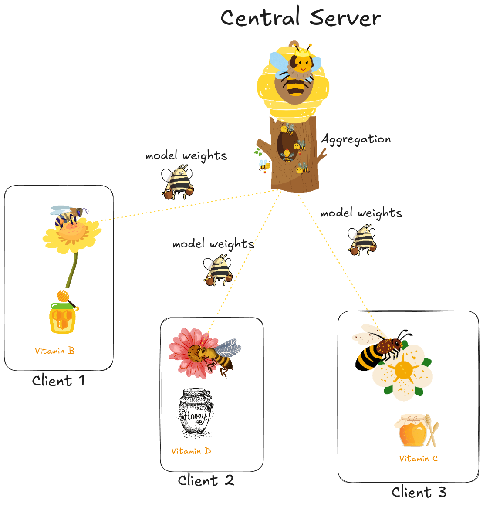
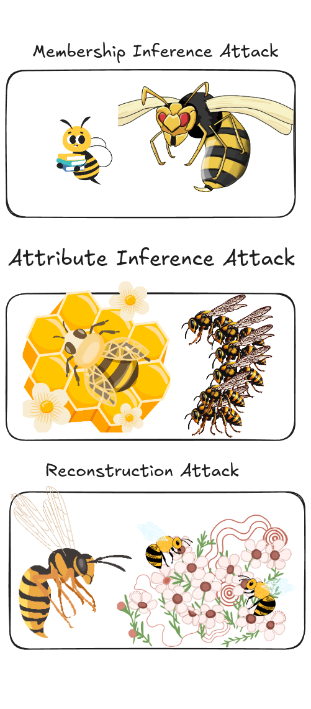

You are on a mission to create the most pure ,sweet healthy honey on the world, as a mad scientist you want to improve your Beehive efficiency and make sure no one can steal your secret recipe of your magic honey.
After some search on how to create your Beehive system, how should the bees communicate together, where to collect the Nectar in protected way from wasp who want to steal your honey and kill your Beehive, you figured out that Federated Beehive will do all what you want but with increase in complexity of your system and a new mindset you should have.

## Traditional ML Systems (centralized)

In centralized systems you collect the flowers into your Beehive and start processing them to create your honey which is not secure because people will now what type of flower this is in it's way

In centralized system, we aggregate the data from multiple source into a specific center where the training happens which takes a lot of bandwidth and move user data out of his device.

## Federated Learning (decentralized)

In FL your bees will go to different types of flower and collect the Nectar you want and go back to the your Beehive in fast and efficient way and they will cover the Nectar in protected container to prevent the smell to go to the dark wasps and other world which is less work, fast, secure but need more overhead into how to communicate with the bees all over the world, how to combine different Nectar, and what if one of them is poisoned ? would this damage all your bee crop? and much more to learn and explore in Federated Learning

## FL Intro

#defintion Federated Learning (FL) : Enables machine learning models on distributed data by moving the training to the data , instead of moving the data to the training.

## why FL instead of centralized machine learning ?

1. **Centralized Learning** is not secure so a lot of bank systems and hospitals must use a secure training like FL
2. **Private data** is more than public data which means more knowledge and patterns to learn new capabilities!
3. **User preference** there are use cases where users just expect that no data leaves their device, ever. If you type your passwords and credit card info into the digital keyboard of your phone, you don’t expect those passwords to end up on the server of the company that developed that keyboard, do you? In fact, that use case was the reason federated learning was invented in the first place.
4. **Regulations** GDPR (Europe), CCPA (California), PIPEDA (Canada), LGPD (Brazil), PDPL (Argentina), KVKK (Turkey), POPI (South Africa), FSS (Russia), CDPR (China), PDPB (India), PIPA (Korea), APPI (Japan), PDP (Indonesia), PDPA (Singapore), APP (Australia), and other regulations protect sensitive data from being moved. In fact, those regulations sometimes even prevent single organizations from combining their own users’ data for machine learning training because those users live in different parts of the world, and their data is governed by different data protection regulations
5. **Less Compute** Training large ml models on big data stores is computationally expensive and traditional centralized training efficiency is limited by single-machine performance.
6. **Fast Training** Federated learning once the data is received the model start training immediately, this gives the user more robust and intelligent system that solves it's needs

## Are we running out of Training data for GenAI?

Publicly available data scraped from the web forms the main source for LLM training and most of LLMs are trained on the publich data, but we still need to collect more data for modalities (text, image, audio, video) and we notice that the architecture of the LLms are similar the main player is the data your train or fine-tune your model on it.
Here comes FL to rescue the situation, FL allow you to train on :

1. Private data
   1. Phones
   2. Emails
2. Regulated
   1. Financial
   2. Legal
3. Sensitive
   1. Doorbell camera images
   2. Medical
4. Isolated
   1. Manufacturing
   2. Automotive

## Wasps, buzz, buzz Attacking your data

Federated Learning is a data minimization solution, trying to prevents direct access to the data.. but there is still some gaps in Federated Systems that needs to be secured.

### Privacy Attacks on Federated Systems

- **Membership inference Attack** Infer Participation of Data Samples
- **Attribute Inference Attack** Infer Unseen Attributes of Training Data
- **Reconstruction Attack** Infer Specific Training Data Samples

We will learn more about how different types of Attacks on FL and how to create your own defenses in another blog.

## References

In the coming blogs i will explain components of Federated Learning but in more details, will try to add math, code and some bees

1. [Flower Framework](https://flower.ai/docs/framework/tutorial-series-what-is-federated-learning.html#Challenges-of-classical-machine-learning)
