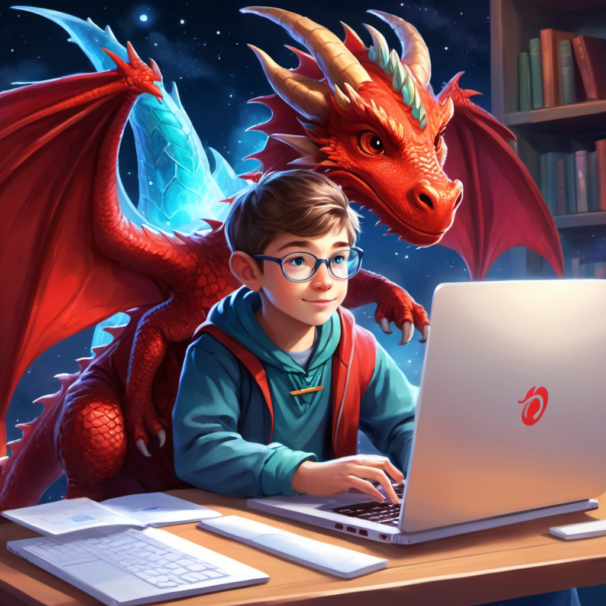

## Table of contents

## The time I spend with kobo

I spend on average 8 hours on my laptop "kobo" doing a lot of programming, machine learning experiments and browsing many taps.

I don't use my phone a lot on average 1 or 2 hours, so i wake up and go to see my little friend and start journaling, wirte my ideas, perparing my todo list.

I have been using it for 4 years now, and it was a nice period i love that it hasn't broken till now, everything is working good even the battery can stand for the 2.5 hours in the battery life with a lot of memory and cpu usage

You can easily say that my laptop is now a part of me i can't live without it any more my dairy, movies, work and college is depending on it

## Who is "Kobo"!

### System Specifications

My laptop is a Gfthin 95 core i7 9th gen, 16 GB RAM, 512GB SSD and GTX 1660 Ti, 120Hz screen

---

## MSI vs Lenovo

### MSI with Linux

After buying it, it wasn't configured with Windows, but was another DOS version so I had to install a Windows version on it. After 1 week I get a lot of errors on it with the external monitor and the WiFi stops working or is not configured. I tried every Hindi video about this problem and gave it to specialists to try it, but in vain, the problem happened again and again.

**The solution:** It was my first year at a computer science college, so the geeky thing was to use Linux. After some search, I installed Ubuntu and then tried a lot of distros like Void Linux, but the one that I picked and still use is the amazing PopOS! which is based on Ubuntu but better than it!  
The WiFi problem doesn't appear again! And for Nvidia graphics, it's solved in PopOS! which has a command to install some drivers. And everything works smoothly

### The Cost of It!

I bought it for the cost of 20,000 EGP, which at the time I bought it was $X, but now 20,000 EGP is worth $XX due to problems in my country.

Its cost at that time is really high for my budget and family, but I insisted on buying it because I knew it would stay with me for years, so I wanted a good one.

### How I Decided to Buy It!

The phrase "Machine learning needs an Nvidia GPU" was dancing in my mind, so my main focus was on a nice GPU card in a laptop with a low budget. After some search, I found that the best choices are MSI or Lenovo, but the Lenovo version cost about 4000 EGP more than the MSI.

> I tested the keyboard of the Lenovo, and every time I felt like I wanted to cut my fingers off

It wasn't available online, so I had to travel 3 hours to the store that sells it. It was a nice experience to buy something I wanted instead of a random gift from my father.

---

## I Am Not a Gamer!

I didn't use it for gaming because I am not a gamer, but I used it heavily in programming and some machine learning and basic computer vision models, and it works so nicely!

## Kobo for ML

Machine learning is a wide area, and you can use the GPU for 3 things:

1. Train a model from scratch
2. Fine-tune a model
3. Evaluate a model (inference)

- **Train** a model from scratch was an ideal task for such a GPU, but I was doing it for multiple computer vision classification tasks, learning new architectures, trying to build...etc. For ML you don't always need a GPU but for deep learning, which is a subset of ML that uses more connected layers (which means more computing power and memory needs), you do.
- **Fine-tune** a model is the case I used the most - I download a trained model and try to make it work better on my data. What you need here is enough GPU RAM - in my case it's a 6GB card. This worked fine with computer vision algorithms and classic NLP models with less than 1 billion parameters. There's no chance to try the LLAMAS models on such a card!
- **Evaluate** a model means to just load the model and not fine-tune it.

I was fine with all the ML tasks I tried to do, unless I opened the door to large language models like the GPT family (ChatGPT for example). These models require a lot of memory and need a good graphics card like an RTX 30 or 40 series to test, and there's no chance to train these models on any RTX card!

### Why Not Just Use the Cloud!

There are two main solutions:

1. Kaggle
   - Kaggle has two GPU options, and I used it a lot, especially if the data was already hosted on Kaggle and was more than 10GB. Other than that, I downloaded a sample of the data and did my work on my own environment with CLI commands and VS Code configurations. This helped me a lot compared to just using the Kaggle editor, and it's faster too! Sometimes the Kaggle kernel panics or just stops responding entirely!
2. Colab
   - Colab restarts after 4 hours and your work can get lost, and lots of annoying things like that happen a lot.
   - You have to pay for the GPU version. You get a number of hours to try it out, and it's faster than my GTX 1660 by a good margin.

But I didn't love these cloud solutions, and I found having my own local setup to be faster and more comfortable.

## Kobo for Web Development

I sometimes work on web projects (Django and JavaScript frameworks, especially AstroJS). I never had any issues building and testing web projects - everything worked nicely and efficiently.

## The Battery Life

The battery life can keep it working for 2.5 hours when the power is out if you switch to battery saver mode. I don't think it could last more than 1 hour in normal mode! This is the laptop's biggest issue. Sometimes it powers off even when fully charged if you do a lot of computation without plugging it in.

## The Heat

I didn't find heat to be a problem or even the fan noise in most of my work. But sometimes when running a deep learning model, the fan noise is a bit loud and it does get really hot. For normal coding and browsing though, there are no issues and the cooling system is fast. Overall I didn't find heat to be a major problem.

## The Keyboard

The keyboard is very responsive and well configured with smooth clicks - no issues or sticky keys even though I have fat fingers!

I've been using this machine for 4 years and I write a lot. No broken keys have happened despite my clumsy fingers. I have a mechanical keyboard that I sometimes use, but I always miss the feel of the built-in keyboard. The red backlight is decent.

## Finally!

I just wanted to say that I love "Kobo" and I've spent nice times with it - some really difficult and others really happy. It's been a loyal friend and something to rely on.
